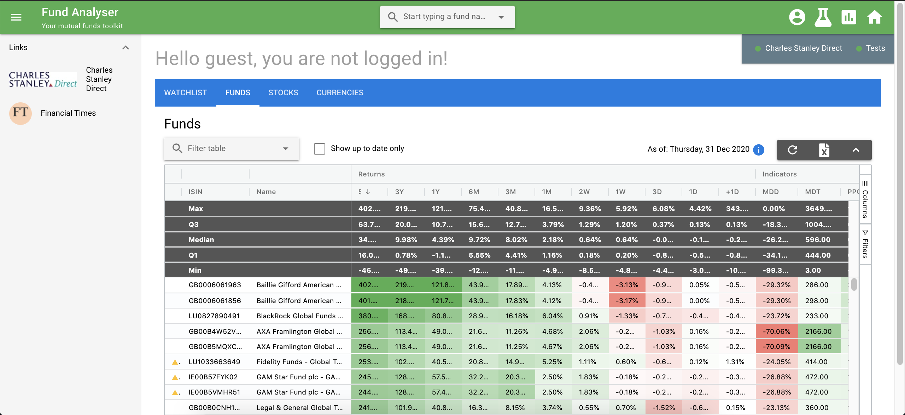

# Fund Analyser

A one stop shop for trading mutual funds and stocks!

## Features

* Comes with pretty dashboard, compare all your favourite funds / stocks at a glance

* Supports algo trading - built in with a few strategies, or you can design your own by extending `fund-analyser-compute/lib/simulate/strategy/strategy.py`!
