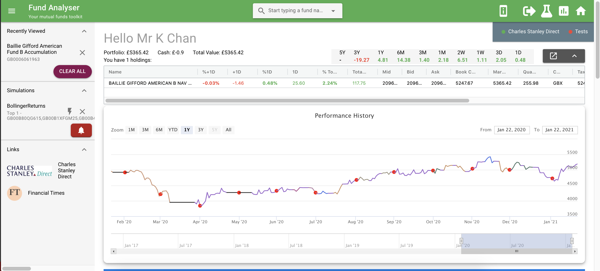

# Fund Analyser

A one stop shop for trading mutual funds and stocks!

## Features

### Monitor

* Comes with personalised dashboard to keep track of your portfolio and favourite funds / stocks:

### Research

* Compare all funds / stocks at a glance:

* Detailed drilldown in each fund / stock:

### Paper and live trading

* Backtest your strategies - use the ones built in, or you can design your own by extending `fund-analyser-compute/lib/simulate/strategy/strategy.py`!

* One-click algo trading. Press the ⚡ button and you are live!

